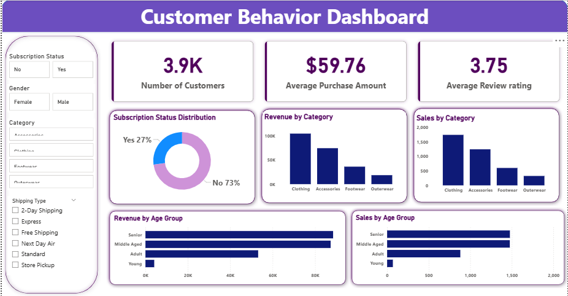

# customer_behaviour_analysis
End-to-end ETL and analytics project analyzing customer shopping behavior using Python, SQL, and Power BI. Raw data is cleaned and transformed in Python, analyzed with SQL for business insights, and visualized through an interactive Power BI dashboard to support data-driven decisions.

# Data Analysis Project: Business Insights & Dashboard

## Overview
This project demonstrates a complete data analysis workflow, from loading raw data to generating actionable business insights. The goal was to explore, clean, and analyze the dataset, answer key business questions, and visualize results in an interactive Power BI dashboard. A final report and presentation were also created to summarize findings for stakeholders.

---

## Dataset
The project uses a structured business dataset containing customer, sales, and product information. Key attributes include:
- Customer details (ID, demographics, subscription status)
- Product details (name, category, price)
- Sales transactions (quantity, discounts applied, revenue)

*Note: The dataset can be substituted with any similar business dataset for replication.*

---

## Tools & Technologies
- **Python**: Data loading, cleaning, and exploratory data analysis (EDA) using `pandas`, `numpy`, and visualization libraries.
- **SQL Server Management Studio (SSMS)**: Running queries to answer business questions and extract insights.
- **Power BI**: Creating interactive dashboards and visualizations.
- **Gamma.ai**: Designing professional presentations summarizing findings.
- **Other Libraries**: Matplotlib, Seaborn for visualizations in Python.

---

## Steps / Workflow
1. **Data Loading**: Imported raw dataset into Python for analysis.  
2. **Data Cleaning**: Handled missing values, corrected inconsistencies, and formatted data for analysis.  
3. **Exploratory Data Analysis (EDA)**: Generated summary statistics, visualizations, and identified key patterns.  
4. **Business Queries in SSMS**: Wrote SQL queries to answer specific business questions (e.g., top products, revenue trends, customer segmentation).  
5. **Dashboard Creation**: Built an interactive Power BI dashboard to visualize trends, distributions, and KPIs.  
6. **Reporting & Presentation**: Compiled insights into a comprehensive report and created a visual presentation using Gamma.ai.

---

## Dashboard
The Power BI dashboard includes:
- Key metrics (total revenue, sales by product/category, customer segmentation)  
- Visualizations: bar charts, pie charts, and trend lines  
- Filters for exploring data by time, category, or customer segment
  


---

## Results & Insights
- Identified top-performing products and high-value customer segments.  
- Discovered trends in sales and subscription behavior.  
- Insights from EDA and SQL queries helped inform business recommendations such as promotional strategies and targeted marketing.  
- The dashboard provides a clear, interactive overview for stakeholders to explore key metrics.

---

## How to Run
1. Clone the repository:
```bash
git clone <your-repo-link>
